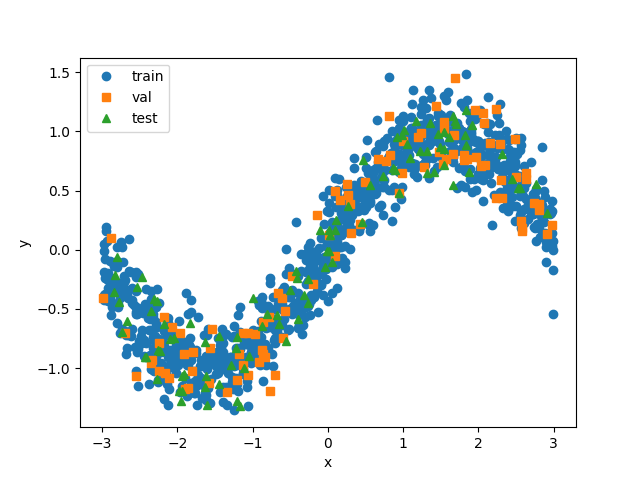
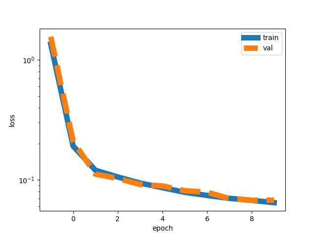
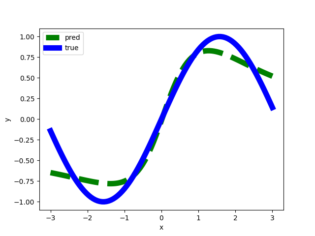

# dnn101
A hands-on tutorial of deep neural networks for mathematicians. 

# Introduction

Deep learning has revolutionized data science and has given state-of-the-art results across applications that require high-dimensional function approximation and classification. This tutorial will help you understand the basics of deep neural networks using hands-on Google Colab notebooks.  This repository will evolve and more example will be added over time. 

# Installation

```console
python -m pip install git+https://github.com/elizabethnewman/dnn101.git
```


# Jupyter Notebook Tutorials

* [1D and 2D Regression](https://github.com/elizabethnewman/dnn101/blob/main/dnn101/regression/DNN101_Regression.ipynb) [](https://colab.research.google.com/github/elizabethnewman/dnn101/blob/main/dnn101/regression/DNN101_Regression.ipynb)

* [2D Classification](https://github.com/elizabethnewman/dnn101/blob/main/dnn101/classification/DNN101_Classification.ipynb) [](https://colab.research.google.com/github/elizabethnewman/dnn101/blob/main/dnn101/classification/DNN101_Classification.ipynb)


* [Convolutional Neural Networks](https://github.com/elizabethnewman/dnn101/blob/main/dnn101/cnn/DNN101_Convolution_Neural_Network.ipynb) [](https://colab.research.google.com/github/elizabethnewman/dnn101/blob/main/dnn101/cnn/DNN101_Convolution_Neural_Network.ipynb)

* [Ablation Study of DNN Architectures](https://github.com/elizabethnewman/dnn101/blob/main/dnn101/utils/DNN101_Ablation_Study_of_DNN_Architectures.ipynb) [](https://github.com/elizabethnewman/dnn101/blob/main/dnn101/utils/DNN101_Ablation_Study_of_DNN_Architectures.ipynb)

* [Testing PyTorch Layers](https://github.com/elizabethnewman/dnn101/blob/main/dnn101/utils/DNN101_Testing_Layers.ipynb) [](https://github.com/elizabethnewman/dnn101/blob/main/dnn101/utils/DNN101_Testing_Layers.ipynb)


# Getting Started

Let's generate a regression example!  First, we load the necessary python packages.
```python
import torch
import torch.nn as nn
import matplotlib as mpl
import matplotlib.pyplot as plt
from dnn101.regression import DNN101DataRegression1D
from dnn101.utils import evaluate, train
```
Next, we generate the data.
```python
# for reproducibility
torch.manual_seed(123)

# data parameters
n_train = 1000                      # number of training points
n_val   = 100                       # number of validation points
n_test  = 100                       # number of test points
sigma   = 0.2                       # noise level
f       = lambda x: torch.sin(x)    # function to approximate
domain  = (-3, 3)                   # function domain

# create data set
dataset = DNN101DataRegression1D(f, domain, noise_level=sigma)

# generate data
x, y = dataset.generate_data(n_train + n_val + n_test)

# split into training, validation, and test sets
(x_train, y_train), (x_val, y_val), (x_test, y_test) = dataset.split_data(x, y, n_train=n_train, n_val=n_val)

# plot!
dataset.plot_data((x_train, y_train), (x_val, y_val), (x_test, y_test))
plt.show()
```


Let's setup a two-layer network, loss function, and optimizer.
```python
# for reproducibility
torch.manual_seed(456)

# training parameters
width      = 10      # number of hidden neurons (larger should be more expressive)
max_epochs = 10      # maximum number of epochs
batch_size = 5       # batch size for mini-batch stochastic optimization

# create network
width = 10
net = nn.Sequential(
    nn.Linear(x_train.shape[1], width),
    nn.Tanh(),
    nn.Linear(width, y_train.shape[1])
)

# choose loss function
loss = torch.nn.MSELoss()

# choose optimizer
optimizer = torch.optim.Adam(net.parameters(), lr=1e-3)
```
Let's train!
```python
# store results (epoch, running_loss, train_loss, validation_loss)
results = []
print_formats = '{:<15d}{:<15.4e}{:<15.4e}{:<15.4e}'

# initial evaluation
loss_train, _  = evaluate(net, loss, (x_train, y_train))
loss_val, _    = evaluate(net, loss, (x_val, y_val))
results.append([-1, 0.0, loss_train, loss_val])

# print results
print((4 * '{:<15s}').format(*('epoch', 'running_loss', 'train_loss', 'val_loss')))
print(print_formats.format(*results[-1]))

# train!
for epoch in range(max_epochs):
   # train for one epoch
   loss_running, _ = train(net, loss, (x_train, y_train), optimizer)
   
   # re-evaluate performance
   loss_train, _  = evaluate(net, loss, (x_train, y_train))
   loss_val, _    = evaluate(net, loss, (x_val, y_val))
   
   # store results
   results.append([epoch, loss_running, loss_train, loss_val])
   print(print_formats.format(*results[-1]))
```
```
epoch          running_loss   train_loss     val_loss       
-1             0.0000e+00     1.3555e+00     1.5617e+00     
0              5.6766e-01     1.9153e-01     2.0998e-01     
1              1.4074e-01     1.2020e-01     1.1166e-01     
2              1.1279e-01     1.0566e-01     1.0281e-01     
3              1.0026e-01     9.4029e-02     9.1510e-02     
4              8.9837e-02     8.6137e-02     8.8997e-02     
5              8.2493e-02     7.8756e-02     8.1213e-02     
6              7.6469e-02     7.4168e-02     7.8977e-02     
7              7.1664e-02     7.0144e-02     6.9784e-02     
8              6.8621e-02     6.7552e-02     6.7584e-02     
9              6.6032e-02     6.4600e-02     6.7844e-02 
```


Let's visualize how we did!
```python
import matplotlib as mpl
mpl.rcParams['lines.linewidth'] = 8

# show convergence of loss
results = torch.tensor(results)
plt.semilogy(results[:, 0], results[:, 2], label='train')
plt.semilogy(results[:, 0], results[:, 3], '--', label='val')
plt.xlabel('epoch')
plt.ylabel('loss')
plt.legend()
plt.show()

# plot prediction vs. ground truth
dataset.plot_prediction(net)
plt.show()
```






See the [dnn101](https://github.com/elizabethnewman/dnn101/tree/main/dnn101) for more details.

# Contributing

TBD

# Cite

TBD
