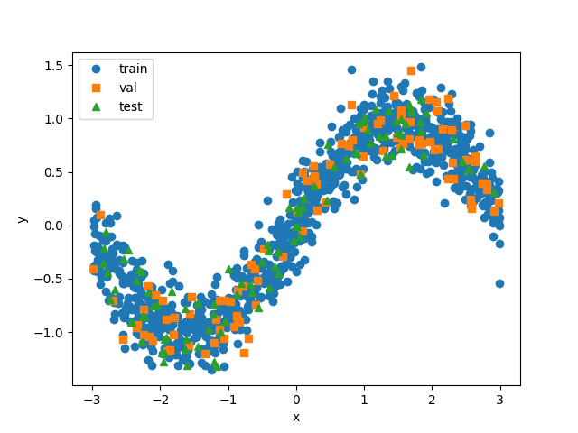

# Regression

Check out the tutorial to play with the code! 

[Regression Tutorial](https://github.com/elizabethnewman/dnn101/blob/main/dnn101/regression/DNN101_Regression.ipynb) [](https://colab.research.google.com/github/elizabethnewman/dnn101/blob/main/dnn101/regression/DNN101_Regression.ipynb)


## How to Generate Data

The core of the regression code are the classes ```DNN101DataRegression1D``` and ```DNN101DataRegression2D```, which generate one-dimensional data or two dimensional data, respectively.   


## Examples
Example syntax and visualization tools are shown below.

```python

# define a function
f = lambda x: torch.sin(x)

# create data set
dataset = DNN101DataRegression1D(f, domain=(-3, 3), noise_level=sigma)

# generate data
x, y = dataset.generate_data(n_train + n_val + n_test)

# split into training, validation, and test sets
(x_train, y_train), (x_val, y_val), (x_test, y_test) = dataset.split_data(x, y, n_train=n_train, n_val=n_val)

# plot!
dataset.plot_data(x_train, y_train, x_val, y_val, x_test, y_test)
plt.show()
```




